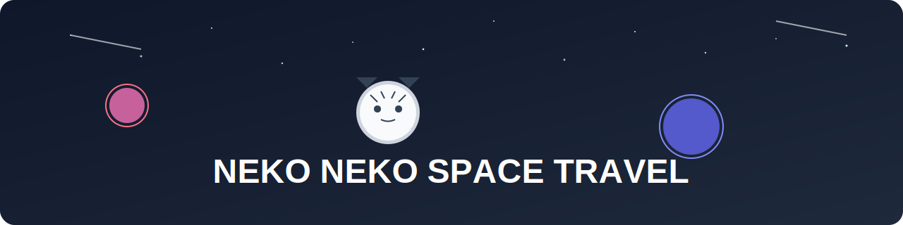

<div align="center">
  
  <h1>🐱 Neko Neko Space Travel 🚀</h1>
  <h3>～ 宇宙への冒険をご一緒に ～</h3>
</div>

## 📘 概要

ねこねこスペーストラベルは、猫型AIエージェントが運営する未来の宇宙旅行代理店です。
最新のAI技術と宇宙工学を組み合わせて、安全で快適な宇宙旅行体験を提供します。

### 🌟 特徴

- 🛸 最新の宇宙船で快適な旅を
- 🏥 徹底した安全管理
- 🌍 地球を見下ろす感動体験
- 🎓 充実した事前トレーニング
- 😺 フレンドリーなねこスタッフ

## 🔧 技術スタック

- **バックエンド**: Python, phidata, OpenAI
- **フロントエンド**: Streamlit
- **データベース**: PostgreSQL
- **支払い処理**: Stripe
- **セキュリティ**: JWT, SSL/TLS
- **監視**: Prometheus, Grafana

## 🚀 主な機能

1. **旅行パッケージ管理**
   - 月周遊コース
   - 火星探検コース
   - 宇宙ステーション滞在

2. **予約・決済システム**
   - オンライン予約
   - 複数の支払いオプション
   - 自動請求書生成

3. **安全管理システム**
   - 健康診断要件チェック
   - 訓練プログラム管理
   - 緊急時対応計画

4. **カスタマーサポート**
   - 24時間対応
   - 多言語サポート
   - AIチャットボット

## 💻 開発環境のセットアップ

1. リポジトリのクローン:
```bash
git clone https://github.com/your-username/nekoneko-space-travel.git
cd nekoneko-space-travel
```

2. 仮想環境の作成と有効化:
```bash
python -m venv .venv
source .venv/bin/activate  # Linux/macOS
.venv\Scripts\activate     # Windows
```

3. 依存パッケージのインストール:
```bash
pip install -r requirements.txt
```

4. 環境変数の設定:
```bash
cp .env.example .env
# .envファイルを編集して必要なAPIキーを設定
```

5. アプリケーションの起動:
```bash
streamlit run app.py
```

## 🌐 デプロイ

本番環境へのデプロイ手順:

1. インフラのセットアップ
2. 環境変数の設定
3. デプロイスクリプトの実行

詳細は [deployment.md](docs/deployment.md) を参照してください。

## 📁 プロジェクト構造

```
nekoneko-space-travel/
├── nekoneko/
│   ├── agents/          # AIエージェント
│   │   ├── booking_agent.py
│   │   ├── safety_agent.py
│   │   ├── customer_service_agent.py
│   │   └── team_agent.py
│   └── tools/           # ユーティリティツール
│       ├── space_weather.py
│       ├── space_map.py
│       ├── payment_processor.py
│       └── training_simulator.py
├── docs/                # ドキュメント
├── tests/               # テストコード
├── app.py              # メインアプリケーション
├── requirements.txt     # 依存パッケージ
└── README.md           # プロジェクト説明
```

## 🧪 テスト

テストの実行:
```bash
pytest tests/
```

## 🤝 コントリビューション

1. このリポジトリをフォーク
2. 機能用のブランチを作成: `git checkout -b new-feature`
3. 変更をコミット: `git commit -am 'Add new feature'`
4. ブランチをプッシュ: `git push origin new-feature`
5. プルリクエストを作成

## 📄 ライセンス

このプロジェクトはMITライセンスの下で公開されています。詳細は [LICENSE](LICENSE) を参照してください。

## 👥 チーム

- 🐱 宇宙猫一郎 - プロジェクトリード
- 😺 月面猫子 - 安全管理責任者
- 😸 星空猫次 - カスタマーサービス

## 📞 お問い合わせ

- Webサイト: https://nekoneko-space.travel
- Email: info@nekoneko-space.travel
- Twitter: @nekonekoSpace

---

🌟 Let's travel to space with cats! 🚀